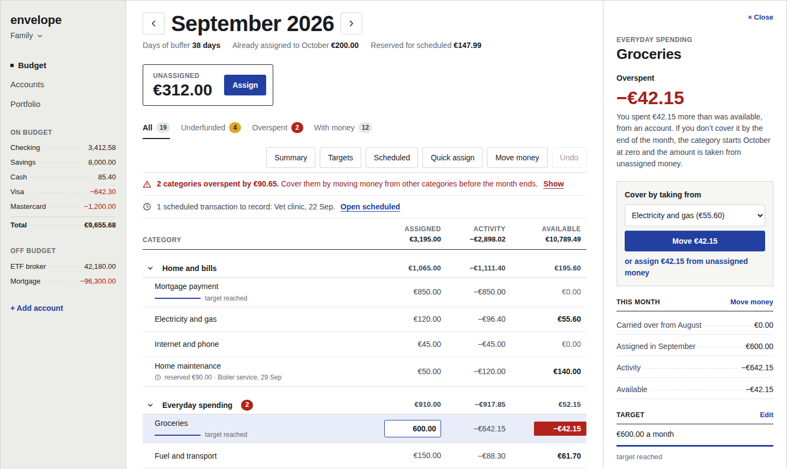
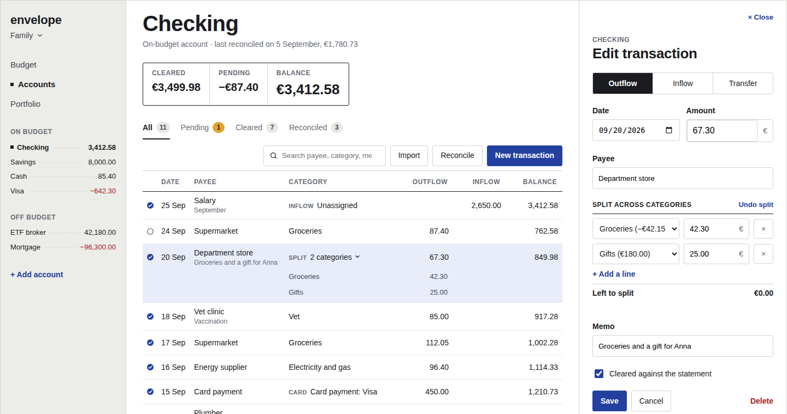
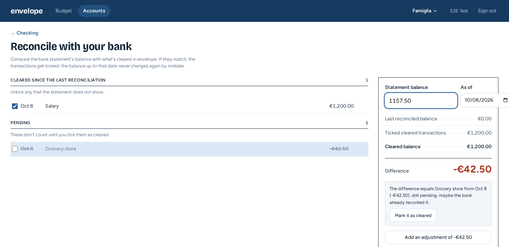
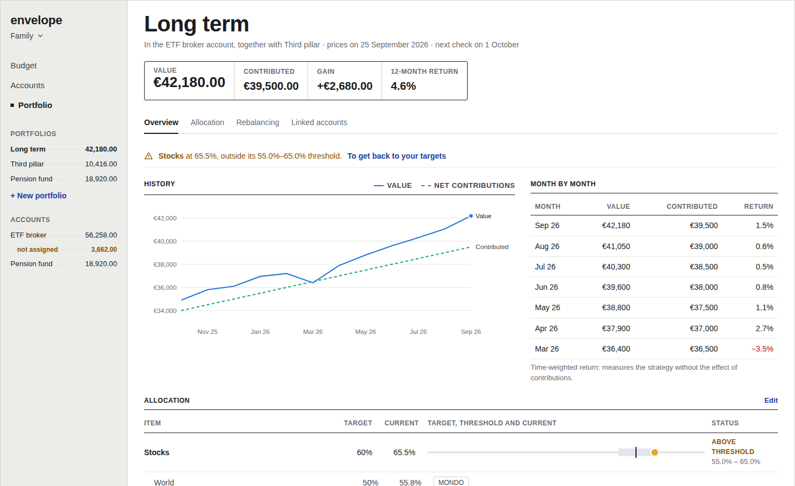
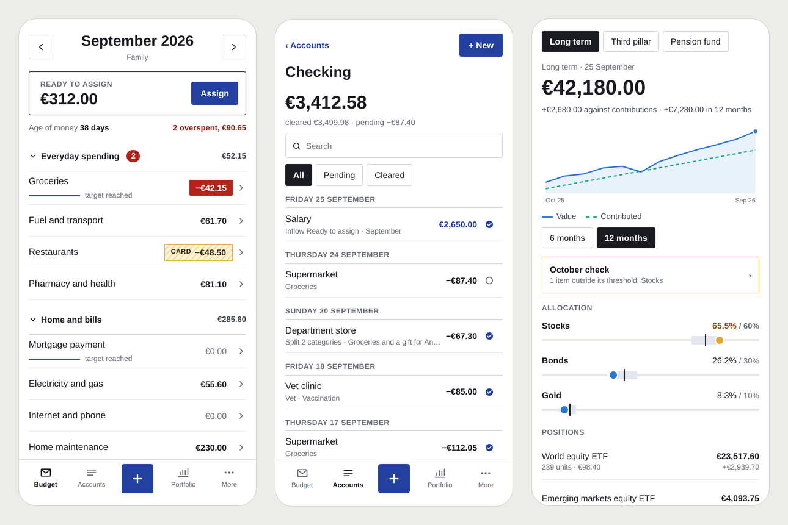

# envelope

**A self-hosted budget and investment app for households.** Budget the money you already have, keep your portfolios on the targets you chose, and keep your data on your own server.

[](https://github.com/aramilialon/project_envelope/actions/workflows/ci.yml)

<picture>
  <source media="(prefers-color-scheme: dark)" srcset="docs/ux/screenshots/budget-month-dark.png">
  
</picture>

> `envelope` is a code name. The app is being built: the backend comes first (milestone 0.1.x), then the web app. The screens on this page come from the [interactive mockups](docs/ux/mockups/); the mockups themselves show the Italian translation.

## What it does

**Envelope budgeting.** Money that comes in stays *unassigned* until you assign it to categories, and you only ever assign money you already have.

- Categories with rollover, credit cards with their own payment category, overspending that is handled differently for cash and for cards.
- Targets for monthly bills, for a sum by a date, for expenses that repeat every few months, and for a balance to keep.
- Import of bank statements (CSV, OFX, QIF, CAMT.053) with duplicate detection, and reconciliation with the bank balance.
- Days of buffer, and instant notifications when a category goes negative.

**Portfolios.** Record your trades; envelope derives positions, value and month-by-month performance.

- Multi-level target allocation with a threshold for each item, and several portfolios in the same brokerage account.
- Mechanical rebalancing: contributions only, full, or just back to the edge of the threshold.
- It never suggests what to buy and never judges your choices: it only computes what your own targets require.

**Your data.**

- Self-hosted, multi-user from day one: a family shares a workspace, each member with a role.
- Full export at any time. Every balance can be rebuilt from the recorded transactions.
- Web and mobile, offline first on the phone; optional end-to-end encryption is planned as a future module.

## A closer look

| Account register | Reconciliation |
| --- | --- |
| [](docs/ux/mockups/account-register.html) | [](docs/ux/mockups/import-reconciliation.html) |
| **Portfolio** | **On the phone** |
| [](docs/ux/mockups/portfolio.html) | [](docs/ux/mockups/) |

## Principles

- **Only money that has arrived.** The budget assigns money already in the accounts, never future income.
- **Your rules, not advice.** Targets, thresholds and rebalancing rules are yours; the app does the arithmetic.
- **Always verifiable.** Amounts are integers in minor units, and the money in the budget always matches the money in the accounts: the core's tests prove it on hundreds of random histories.
- **The data belongs to you.** No tracking, no selling of data, and a self-hosted install talks only to the services you configure.

## Status and roadmap

| Milestone | Contents | Status |
| --- | --- | --- |
| 0.1.0 – 0.1.2 | API skeleton, database schema, Row-Level Security per workspace, authentication with Keycloak (OpenID Connect) | Released |
| 0.1.3 | Budget API | Released |
| 0.1.4 | Import | Released |
| 0.1.5 | Queue and notifications | Released |
| 0.1.6 | Offline sync | Released |
| 0.1.7 – 0.1.8 | Web app, then a real month of a household budget run with the app alone | Planned |
| 0.2.x | Portfolios, prices, allocation and rebalancing | Planned |
| 0.3.x | Mobile app | Planned |

The complete roadmap, including what comes after 1.0.0, is in the [design document](docs/design.md#roadmap); changes are listed in the [changelog](CHANGELOG.md).

## Getting started

Everything from a fresh Debian 13 virtual machine to the first test run is in [docs/getting-started.md](docs/getting-started.md), with an Ansible playbook that prepares the machine for you. With the tools already installed:

```bash
pnpm install
pnpm test
```

## Repository layout

| Folder | Contents |
| --- | --- |
| `packages/core` | Pure domain logic: money, months, budget month, credit cards, transaction aggregation. No network or database |
| `apps/api` | The server: Fastify, PostgreSQL through plain SQL, Keycloak for sign-in |
| `apps/web` | The browser app: Vite, React, a PWA shell so far |
| `apps/` | Next: `mobile` (Expo) |
| `infra/` | `docker-compose` for local development (PostgreSQL, Keycloak) and the Ansible playbook for the development machine |
| `docs/` | Design document, getting started, how-to guides, decision records, glossary, interface mockups |
| `scripts/` | GitHub setup (labels, milestones, protected main) and Git hooks |

## Documentation

- [Design document](docs/design.md): vision, features, architecture, interface, roadmap and decisions
- [Documentation index](docs/README.md): getting started, how-to guides, decision records, glossary
- [Interface mockups](docs/ux/mockups/): download the repository and open them in a browser

## Contributing

Every change reaches `main` through a pull request, with commit messages and titles in the form `type(scope): description`. The workflow is described in [docs/how-to/work-with-issues-and-pull-requests.md](docs/how-to/work-with-issues-and-pull-requests.md).

Code, comments, documentation and commit messages are in English. The interface is translatable: English is the source language and Italian the first complete translation ([ADR 0004](docs/adr/0004-internationalization.md)).

## License

[AGPL-3.0](LICENSE).
